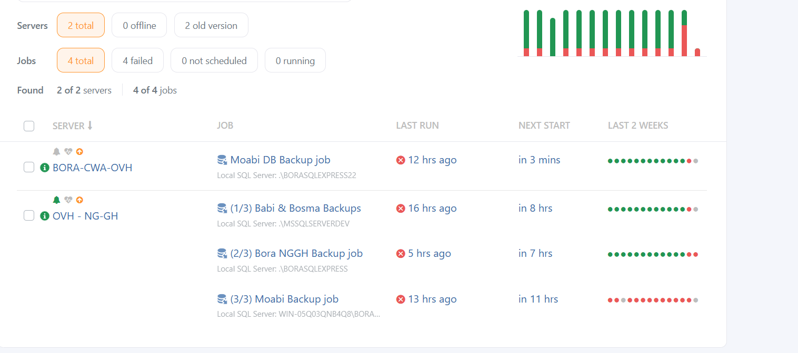
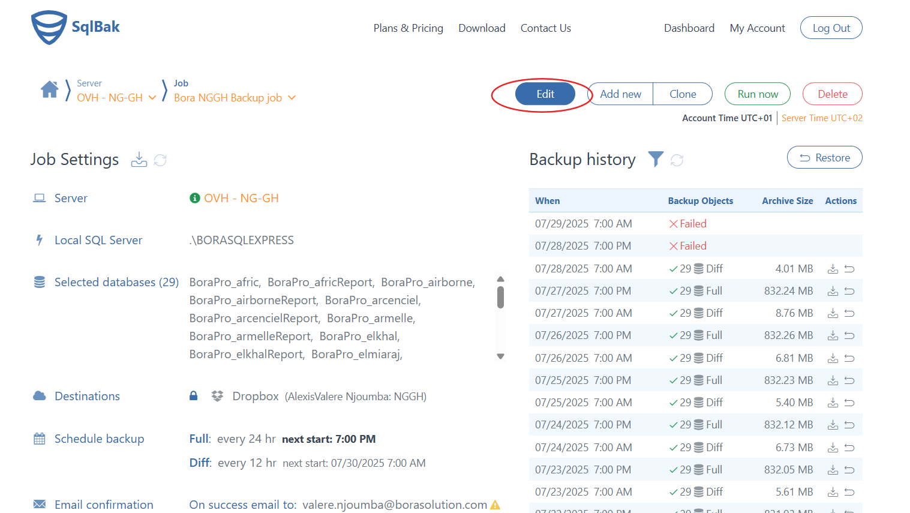
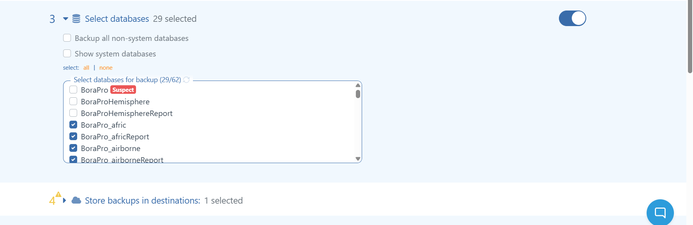
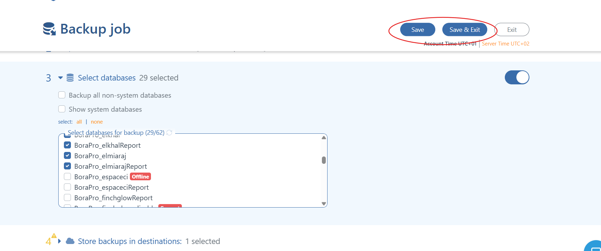

# ☁️ SOP – Éditer un job existant pour ajouter la sauvegarde d'une nouvelle base de données

**Version**: 1.1
**Responsable**: IT Manager  
**Équipe concernée**: Techniciens terrain, Administrateurs Cloud  
**Dernière mise à jour**: 2025-08-25  
**Statut**: ✅ Maintenu

## 🎯 Objectif

Cette procédure détaille les étapes à suivre pour éditer un Job dans SqlBak afin d'y ajouter une nouvelle base de données à sauvegarder.

## 🗺️ Vue d’ensemble du processus

---

## Prérequis

## 🛠️ Prérequis & Accès

- ✅ Accès administrateur au serveur local de l’agence
- ✅ Accès Dropbox MITS : `Dropbox\MITS\Admin\Cloud Credentials`
- ✅ Droits d’administration SQL Server sur le serveur Cloud
- ✅ Convention de nommage MITS appliquée aux fichiers

## 🧩 Procédure détaillée

1. Connectez-vous à votre compte utilisateur sur le site officiel de [SqlBak](https://sqlbak.com/) avec vos identifiants.

2. Cliquez sur le lien **Dashboard** pour acceder à votre tableau de bord. Une liste de serveurs et de jobs apparaît.
  

3. Sélectionnez le job que vous voulez modifier et cliquez sur le bouton **Edit**.
   

4. Cliquez sur le lien **Select databases** et cochez la base de données que vous souhaitez sauvegarder.
   

5. Cliquez enfin sur le bouton **Save** ou **Save & Exit**.
   
     
---
## Conseils & Bonnes pratiques

- Testez la restauration de sauvegardes régulièrement.
- Conservez les fichiers `.bak` dans un emplacement sécurisé.
- Vérifiez les notifications pour détecter rapidement les problèmes.

---

## 📎 Annexe A – Checklist Edition et Sauvegarde

| Tâche | Réalisée (✓/✗) | Commentaire |
|-------|-----------------|-------------|
| Connexion au compte SqlBak  |             |             |
| Job à éditer selectionné |             |             |
| Base de données à ajouter à la sauvegarde cochée|             |             |
| Modifications validée par le bouton `Save`|             |             |
| Job édité avec succès |             |             |

---