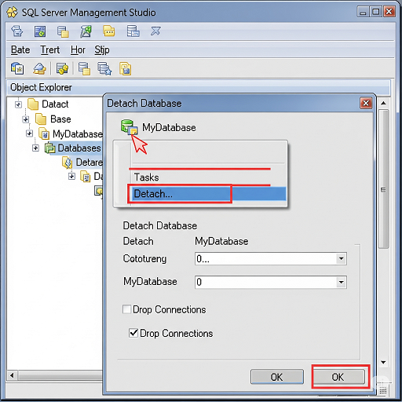
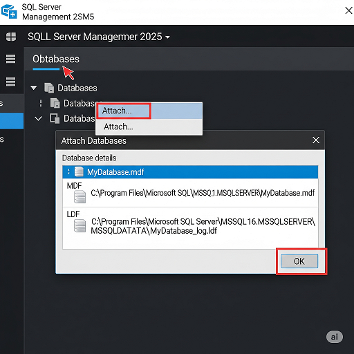

# ☁️ SOP – Migration d’une base de données de SQL Server 2005 vers SQL Server 2022

**Version**: 1.1.1
**Responsable**: IT Manager  
**Équipe concernée**: Techniciens terrain, Administrateurs Cloud  
**Dernière mise à jour**: 2025-08-20  
**Statut**: ✅ Maintenu

## 🎯 Objectif

Documenter l’ensemble des étapes nécessaires pour migrer une base de données Bora de SQL Serveur 2005 vers SQL Server 2022, de façon sécurisée, standardisée et traçable.

## 🗺️ Vue d’ensemble du processus

---

## Prérequis

## 🛠️ Prérequis & Accès

- ✅ Accès administrateur au serveur SQL Server 2005.
- ✅ Accès Dropbox MITS : `Dropbox\MITS\Admin\Cloud Credentials`
- ✅ Droits d’administration sur le serveur SQL Server 2022.
- ✅ Suivi de la procédure standard “Guide d'utilisation de SqlBak”

## 🧩 Procédure détaillée

### 1. 📥 Sauvegarder la base de données avec SqlBak

Pour cette étape, bien vouloir vous référer à la procédure pour [Editer un Job existant et ajouter une base de données avec Sqlbak](https://github.com/Akibari-Tech/Documentation/blob/main/SOP/editer_job_pour_ajouter_bdd_dans_sqlbak.md). 

### 2. Détacher la base de données de l’instance Sql Server 2005

- Ouvrir SSMS. 
- Faire un **clic-droit** sur la base de données, puis **➜ Tasks ➜ Detach…**
- Vérifier qu’aucune connexion active ne bloque la base (✅ **Cocher la case Drop Connections** si elle n'est pas cochée par défaut).
- Cliquer sur **OK ➜**. La base est détachée, les fichiers `.mdf` et `.ldf` restent sur le disque.

### 3. Attacher la base de données à l’instance Sql Server 2022

- Ouvrir SSMS 2022.
-	Faire un **clic-droit** sur **Databases ➜ Attach…**
-	Parcourir vers le fichier `.mdf` récupéré de **l’ancien serveur 2005**.
-	Vérifier que le `.ldf` est bien trouvé ou le remapper si besoin.
-	Cliquer sur **OK**.

###	Remarques importantes

- ✅ Vérifier la compatibilité : Après l’attachement, faire une mise à jour du niveau de compatibilité de la base (`ex. : ALTER DATABASE [MaBase] SET COMPATIBILITY_LEVEL = 160; pour SQL Server 2022`). 
- ✅ S’assurer que les fichiers `.mdf` et `.ldf` sont copiés sur le nouveau serveur.
- ✅ Pour les très grandes bases, préférer **Backup/Restore** plutôt que `Detach/Attach`.
- ✅ Vérifier les logins : Les **comptes SQL Server** doivent être recréés ou transférés.

### 📎 Annexe – Checklist de Migration

| Tâche | Réalisée (✓/✗) | Commentaire |
|------|-----------------|-------------|
| BDD Sql Server 2005 sauvegardée avec SqlBak |             |             |
| BDD Sql Server 2005 détachée |             |             |
| Les fichiers `.mdf` et `.ldf` sont disponibles sur le disque |             |             | 
| BDD attachée dans Sql Server 2022 |             |             |
| Les fichiers `.mdf` et `.ldf` sont copiés sur le nouveau serveur |             |             |
| Logins vérifiés. Les comptes SQL Server ont été transférés |             |             |

---