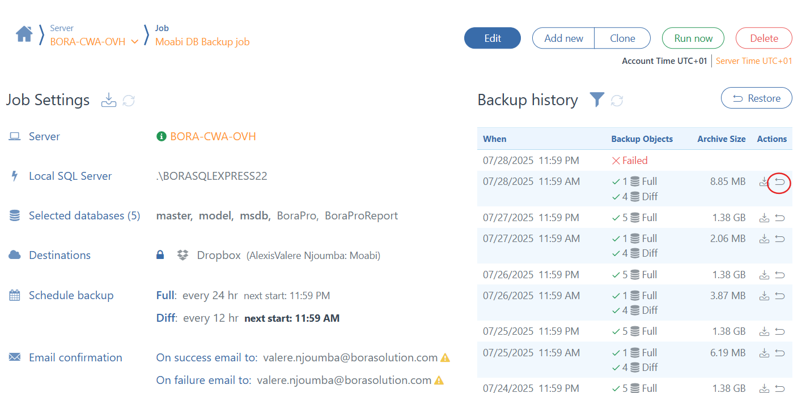

# ☁️ SOP – Restauration d’une base de données avec SqlBak

**Version**: 1.1 
**Responsable**: IT Manager  
**Équipe concernée**: Techniciens terrain, Administrateurs Cloud  
**Dernière mise à jour**: 2025-08-22 
**Statut**: ✅ Maintenu

## 🎯 Objectif

Cette procédure détaille les étapes à suivre pour effectuer la restauration d'une base de données avec SqlBak

## 🗺️ Vue d’ensemble du processus

---

## Prérequis

## 🛠️ Prérequis & Accès

- ✅ Accès administrateur au serveur local de l’agence
- ✅ Accès Dropbox MITS : `Dropbox\MITS\Admin\Cloud Credentials`
- ✅ Droits d’administration SQL Server sur le serveur Cloud
- ✅ Convention de nommage MITS appliquée aux fichiers

## 🧩 Procédure détaillée

### 3. Restaurer une base de données avec SqlBak

1. Connectez-vous à votre compte utilisateur sur le site officiel de [SqlBak](https://sqlbak.com/) avec vos identifiants.

2. Cliquez sur le lien **Dashboard** pour acceder à votre tableau de bord.
  

3. Dans l’interface SqlBak, allez dans l’onglet **Restore**.
   

3. Sélectionnez le fichier de sauvegarde `.bak` à restaurer.
4. Choisissez la base de données cible.
5. Suivez les instructions pour démarrer la restauration.

---

## 📎 Annexe A – Checklist de restauration

| Tâche | Réalisée (✓/✗) | Commentaire |
|-------|-----------------|-------------|
| Connexion au compte SqlBak  |             |             |
| Fichier de sauvegarde `.bak` sélectionné |             |             |
| Base de données restaurée|             |             |

---