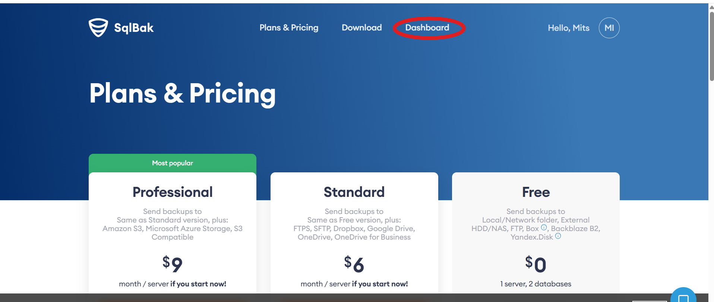
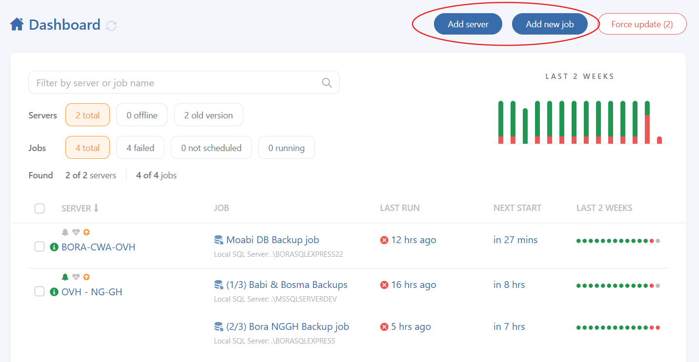

# ☁️ SOP – Sauvegarde d’une base de données avec SqlBak

**Version**: 1.1
**Responsable**: IT Manager  
**Équipe concernée**: Techniciens terrain, Administrateurs Cloud  
**Dernière mise à jour**: 2025-08-19  
**Statut**: ✅ Maintenu

## 🎯 Objectif

Cette procédure détaille les étapes à suivre pour effectuer la sauvegarde d'une base de données avec SqlBak. Elle est automatiquement stockée dans un répertoire Dropbox

## 🗺️ Vue d’ensemble du processus

---

## Prérequis

## 🛠️ Prérequis & Accès

- ✅ Accès administrateur au serveur local de l’agence.
- ✅ Accès Dropbox MITS : `Dropbox\MITS\Admin\Cloud Credentials`
- ✅ Droits d’administration SQL Server sur le serveur Cloud.
- ✅ Convention de nommage MITS appliquée aux fichiers.

## 🧩 Procédure détaillée

### A. Connexion

- Connectez-vous à votre compte utilisateur sur le site officiel de [SqlBak](https://sqlbak.com/) avec vos identifiants.
- Cliquez sur le lien **Dashboard** pour acceder à votre tableau de bord.
  

- Ajoutez votre serveur SQL en suivant les instructions `Add Server` et `Add New Job`.
    

### B. Création et configuration d’une sauvegarde

1. Cliquez sur **Add New Job**.
2. Sélectionnez la base de données à sauvegarder et le type de job.
   

3. Configurez le type de sauvegarde :
   - **Full** : sauvegarde complète./
   - **Differential** : sauvegarde différentielle.
   - **Transaction Log** : sauvegarde du journal des transactions.
4. Choisissez la destination (cloud, local, FTP, etc.).
5. Définissez la planification (horaire, fréquence).
6. Cliquez sur **Save & Run**.

## Remarques

La destination des fichiers de backup généré est Dropbox , sous le dossier `\Apps\SqlBak\`.
La fréquence des backups varie:
- 24h pour les backups complets
- 12h pour les backups partiels

## 📎 Annexe A – Checklist de sauvegarde

| Tâche | Réalisée (✓/✗) | Commentaire |
|-------|-----------------|-------------|
| Connexion au compte SqlBak  |             |             |
| Serveur SQL et Job ajoutés |             |             |
| BDD à sauvegarder ajoutée |             |             |
| Sauvegarde planifée et configurée |             |             |

---